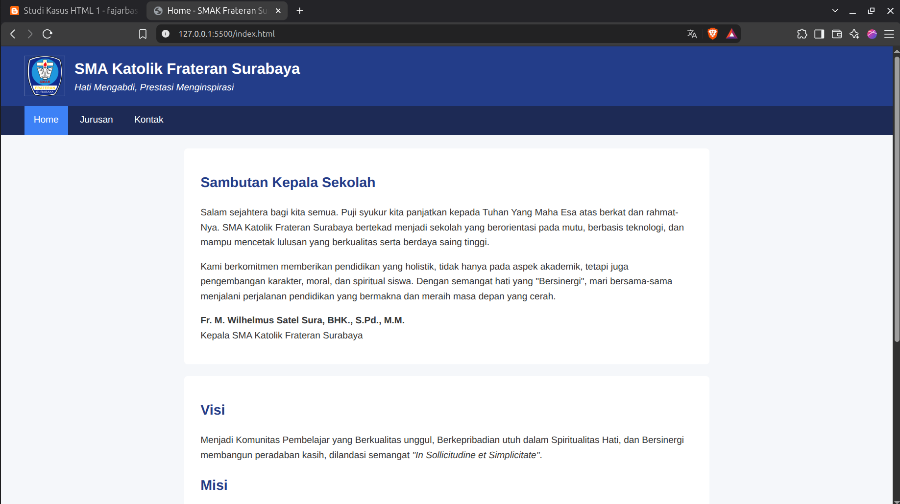
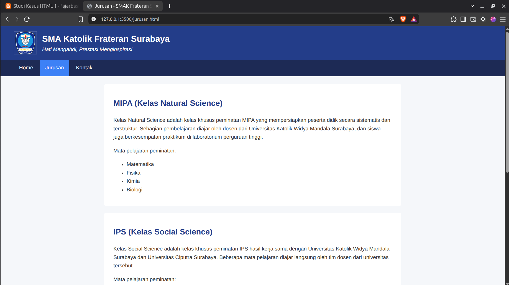
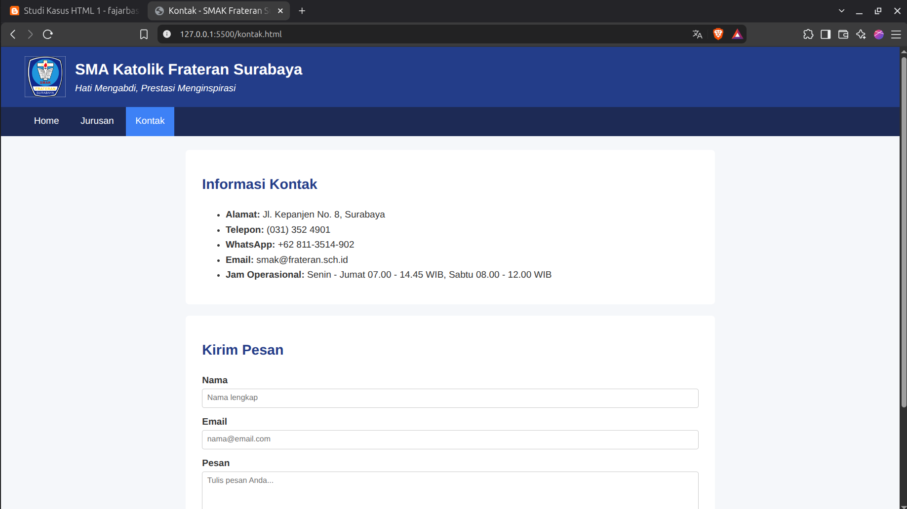

# Studi Kasus HTML 1 — Website Profil SMAK Frateran Surabaya

Website profil sekolah sederhana yang terdiri dari 3 halaman yang saling terhubung.

## Link Website Asli Sekolah

https://frateran.sch.id/

## Struktur File

```
index.html      Halaman Home: logo, nama sekolah, sambutan kepala sekolah, visi & misi
jurusan.html    Halaman Jurusan: daftar jurusan dan tabel jumlah siswa
kontak.html     Halaman Kontak: informasi kontak dan form kontak
style.css       CSS untuk ketiga halaman
images/logo.png Logo sekolah
```

## Screenshot

### Home (index.html)



### Jurusan (jurusan.html)



### Kontak (kontak.html)



## Catatan

- Isi sambutan, visi, misi, jurusan, dan kontak diambil dari website resmi sekolah.
- Data jumlah siswa pada tabel adalah data ilustrasi, bukan data resmi sekolah.
