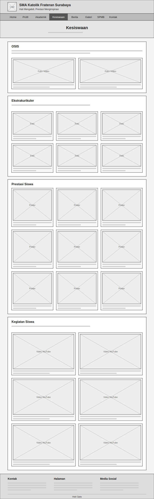
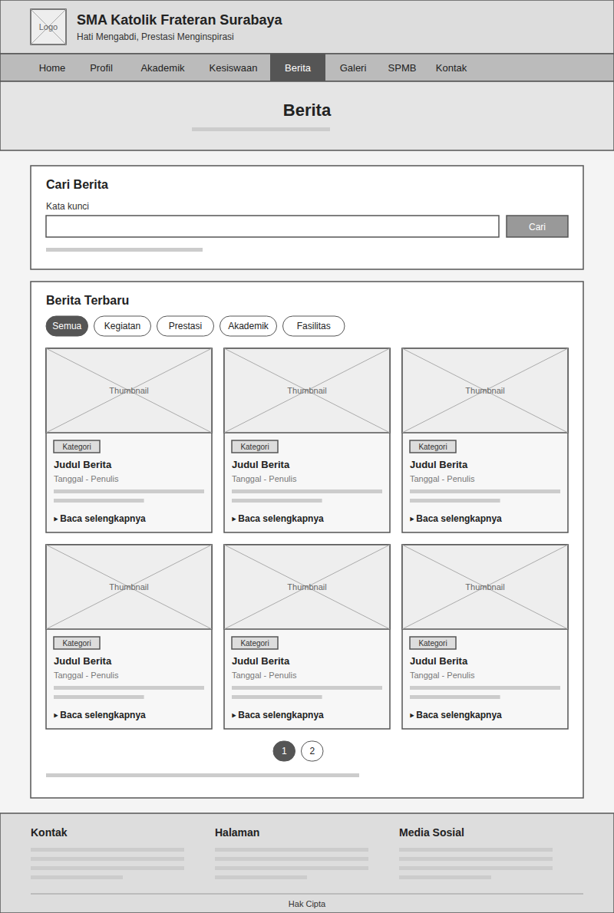
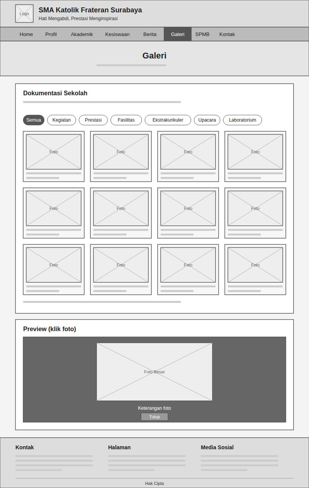
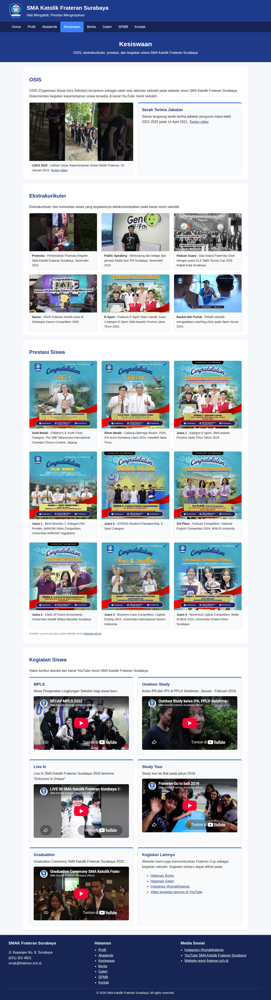
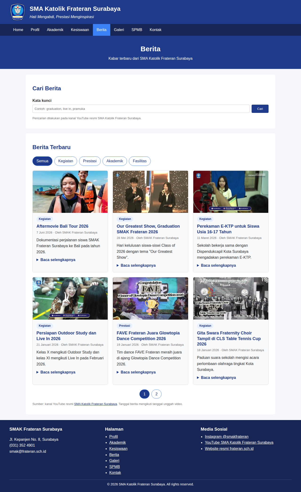
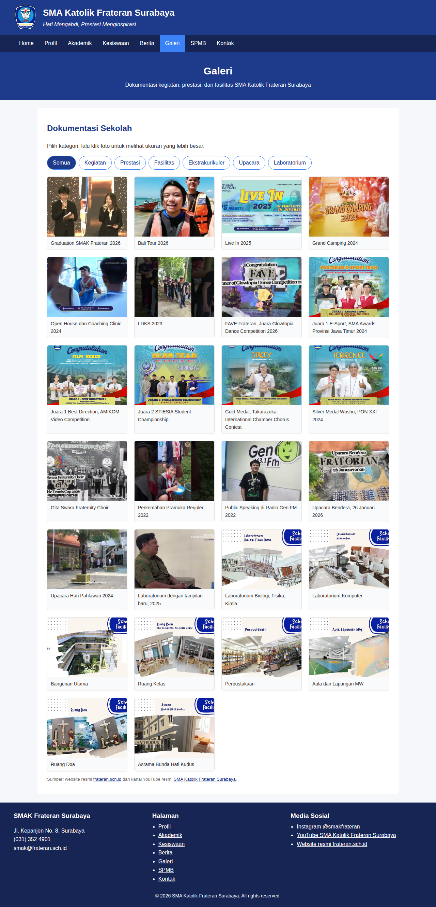
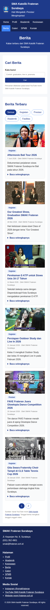
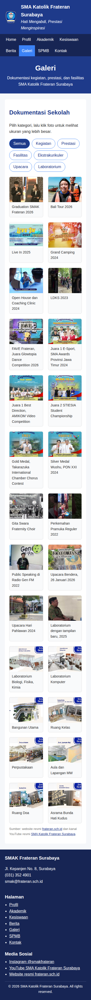

# Website Profil SMAK Frateran Surabaya (Versi 2)

Lanjutan dari task meeting 3. Website profil sekolah yang lebih lengkap dengan delapan halaman, dibuat menggunakan HTML dan CSS saja.

- Website: https://jojoevan.github.io/web-programming/task-meeting-4/
- PRD: [PRD.md](PRD.md)

## Sumber

- https://frateran.sch.id/
- https://spmb.frateran.sch.id/
- https://www.youtube.com/@SMAKFrateran

## Struktur File

```
index.html      Home: hero, tentang sekolah, nilai FRATER, prestasi, berita terbaru, lembaga kerja sama
profil.html     Profil: sambutan kepala sekolah, visi misi, motto, makna logo, sejarah
akademik.html   Akademik: kurikulum, kelas Natural Science dan Social Science, fasilitas
kesiswaan.html  Kesiswaan: OSIS, ekstrakurikuler, prestasi siswa, kegiatan siswa
berita.html     Berita: pencarian, filter kategori, pagination, detail berita
galeri.html     Galeri: filter kategori dan preview foto ukuran besar
spmb.html       SPMB: alur pendaftaran, jadwal, biaya, potongan dan beasiswa
kontak.html     Kontak: informasi kontak, jam operasional, form, peta lokasi
style.css       CSS untuk semua halaman
images/         Logo, foto sekolah, fasilitas, poster prestasi, berita, dan galeri
wireframe/      Wireframe setiap halaman
screenshots/    Screenshot hasil akhir (desktop dan mobile)
```

## Wireframe

| Home | Profil | Akademik | Kesiswaan |
|---|---|---|---|
|  |  |  |  |

| Berita | Galeri | SPMB | Kontak |
|---|---|---|---|
|  |  |  |  |

## Screenshot

### Desktop

| Home | Profil | Akademik | Kesiswaan |
|---|---|---|---|
|  |  |  |  |

| Berita | Galeri | SPMB | Kontak |
|---|---|---|---|
|  |  |  |  |

### Mobile

| Home | Berita | Galeri | SPMB | Kontak |
|---|---|---|---|---|
|  |  |  |  |  |

## Catatan

- Seluruh isi diambil dari website resmi sekolah, website SPMB, dan kanal YouTube resmi sekolah.
- Bagian yang datanya tidak tersedia di sumber resmi tidak ditampilkan.
- Form kontak hanya tampilan dan tidak mengirim pesan.
- Berita dan sebagian foto galeri diambil dari kanal YouTube resmi sekolah; tanggal berita mengikuti tanggal unggah video.
- Filter, pagination, dan preview galeri dibuat dengan CSS saja (radio button dan `:target`), tanpa JavaScript.
