# Website Profil SMAK Frateran Surabaya (Versi 2)

Lanjutan dari task meeting 3. Website profil sekolah yang lebih lengkap dengan enam halaman, dibuat menggunakan HTML dan CSS saja.

- Website: https://jojoevan.github.io/web-programming/task-meeting-4/
- PRD: [PRD.md](PRD.md)

## Sumber

- https://frateran.sch.id/
- https://spmb.frateran.sch.id/
- https://www.youtube.com/@SMAKFrateran

## Struktur File

```
index.html      Home: hero, tentang sekolah, nilai FRATER, prestasi, lembaga kerja sama
profil.html     Profil: sambutan kepala sekolah, visi misi, motto, makna logo, sejarah
akademik.html   Akademik: kurikulum, kelas Natural Science dan Social Science, fasilitas
kegiatan.html   Kegiatan: MPLS, Outdoor Study, Live In, Study Tour, Graduation, prestasi siswa
spmb.html       SPMB: alur pendaftaran, jadwal, biaya, potongan dan beasiswa
kontak.html     Kontak: informasi kontak, jam operasional, form, peta lokasi
style.css       CSS untuk semua halaman
images/         Logo, foto sekolah, fasilitas, dan poster prestasi
wireframe/      Wireframe setiap halaman
screenshots/    Screenshot hasil akhir (desktop dan mobile)
```

## Wireframe

| Home | Profil | Akademik |
|---|---|---|
| 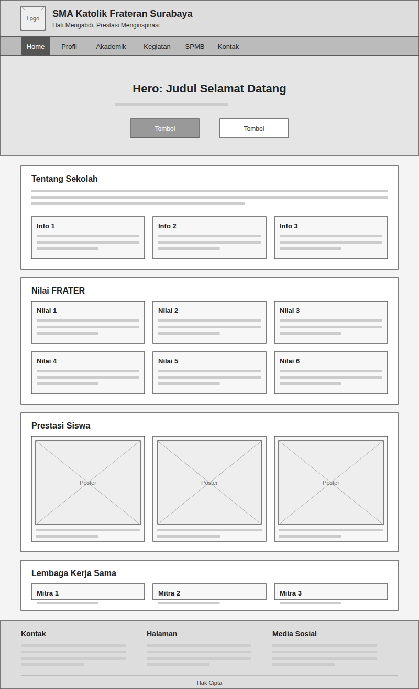 | 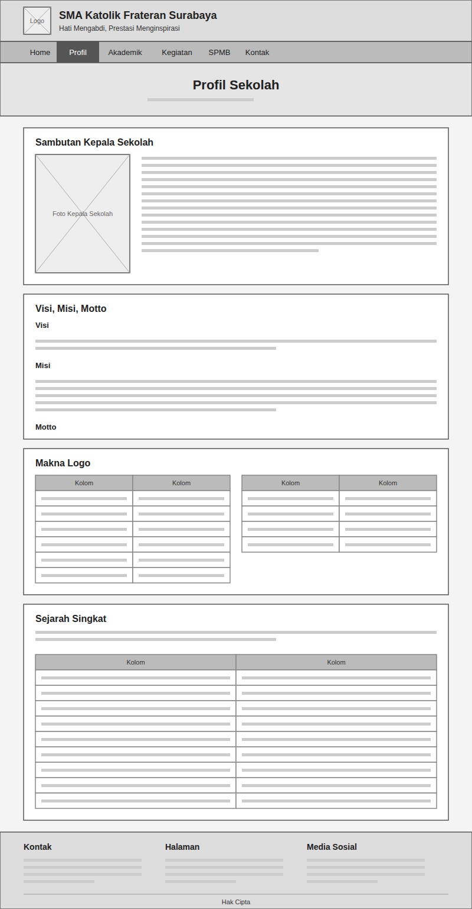 | 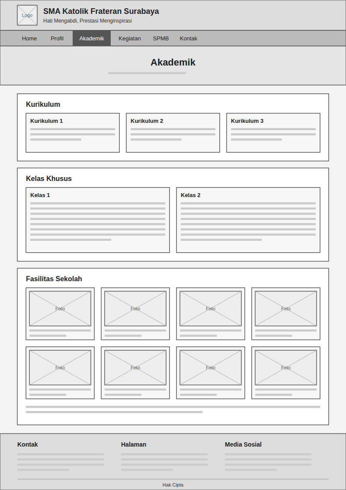 |

| Kegiatan | SPMB | Kontak |
|---|---|---|
| 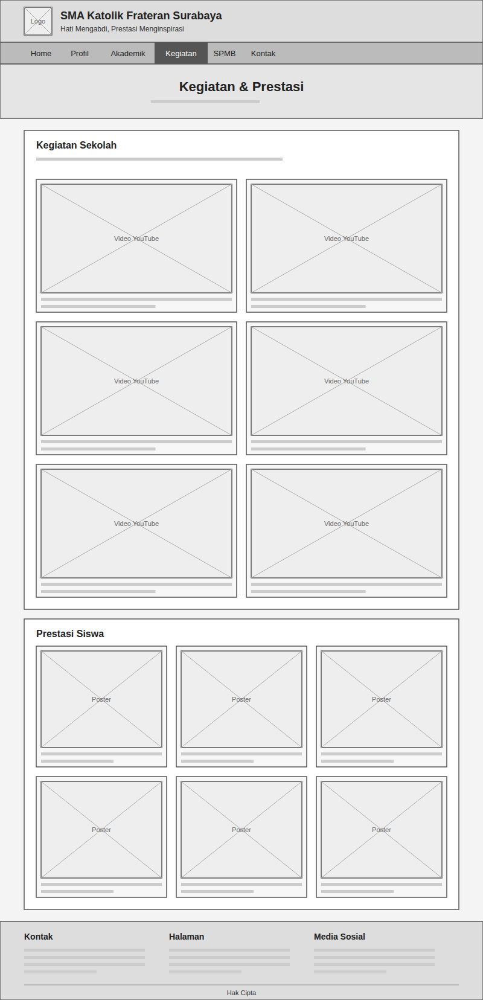 | 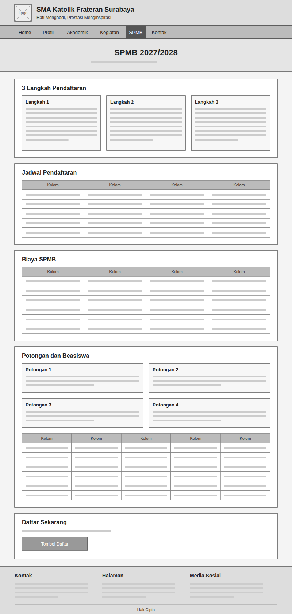 | 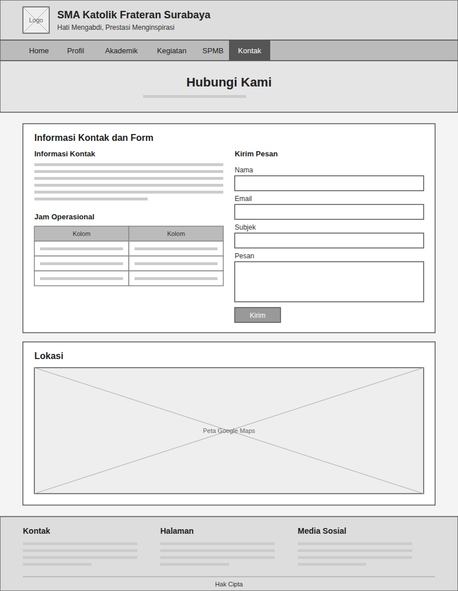 |

## Screenshot

### Desktop

| Home | Profil | Akademik |
|---|---|---|
| 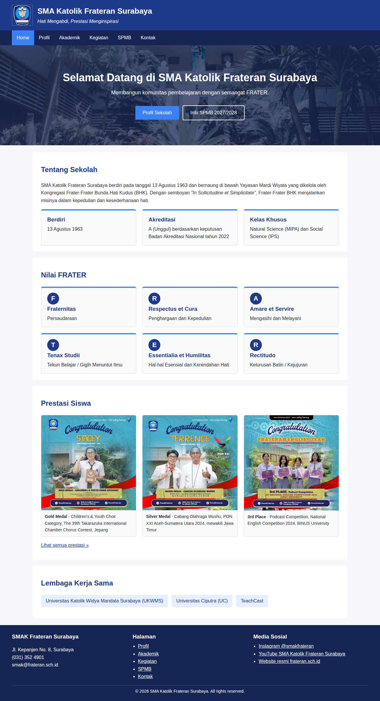 | 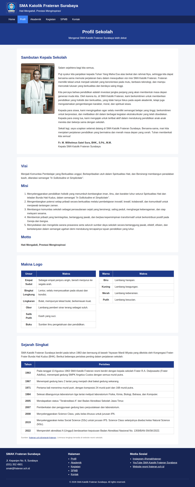 | 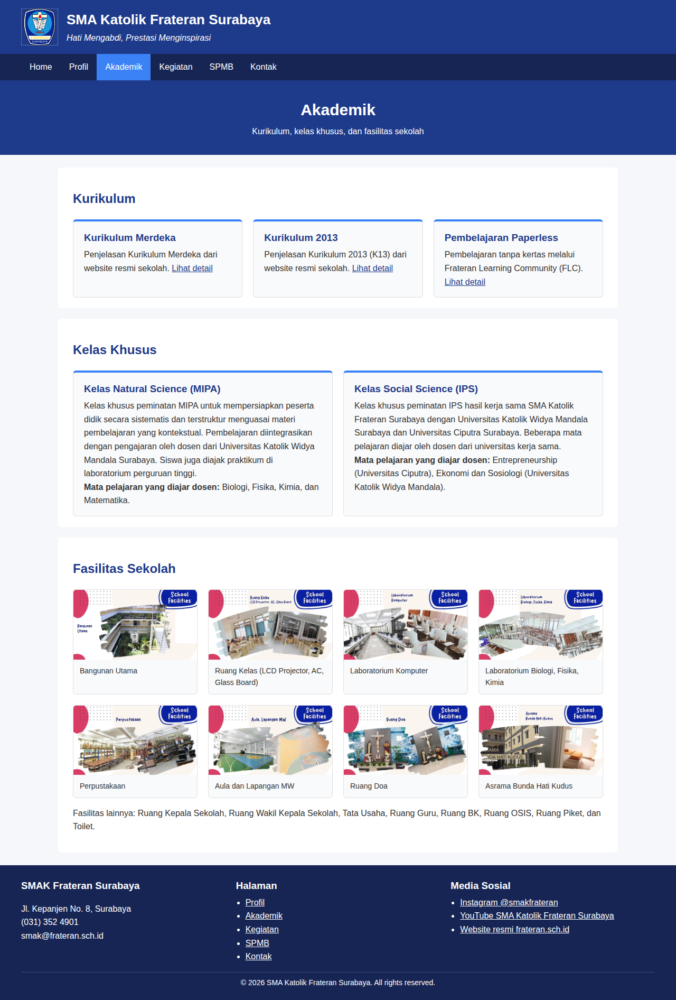 |

| Kegiatan | SPMB | Kontak |
|---|---|---|
| 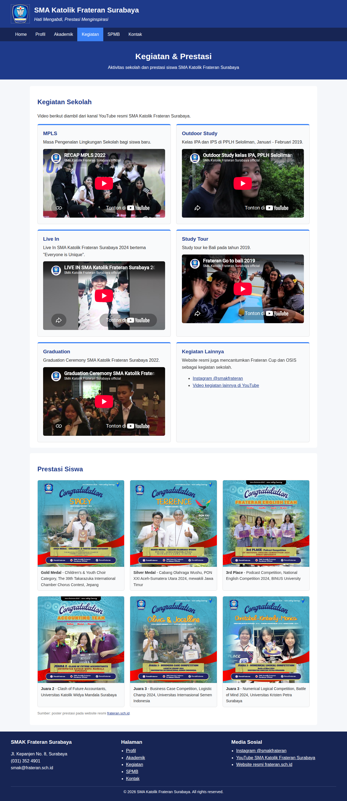 | 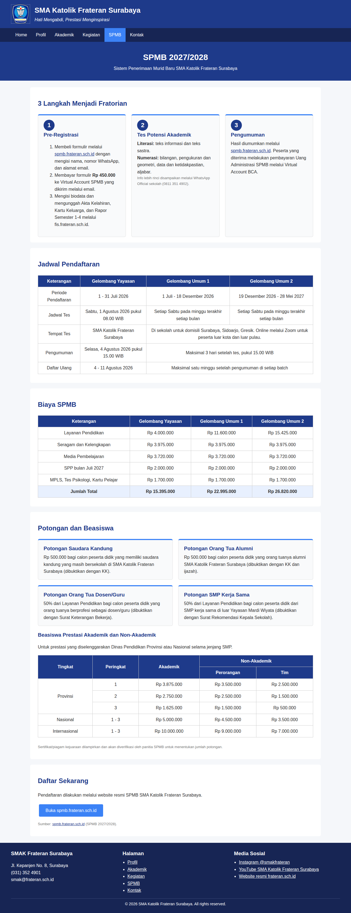 | 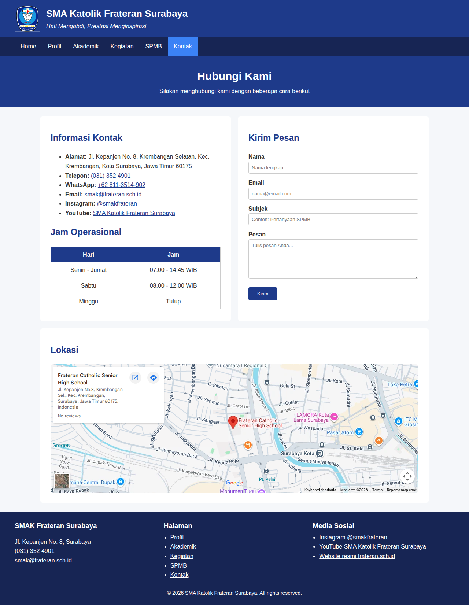 |

### Mobile

| Home | SPMB | Kontak |
|---|---|---|
| 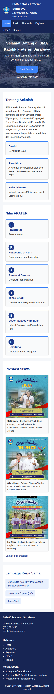 | 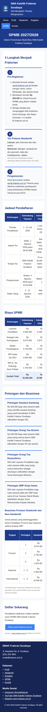 | 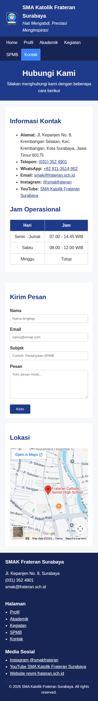 |

## Catatan

- Seluruh isi diambil dari website resmi sekolah, website SPMB, dan kanal YouTube resmi sekolah.
- Bagian yang datanya tidak tersedia di sumber resmi tidak ditampilkan.
- Form kontak hanya tampilan dan tidak mengirim pesan.
