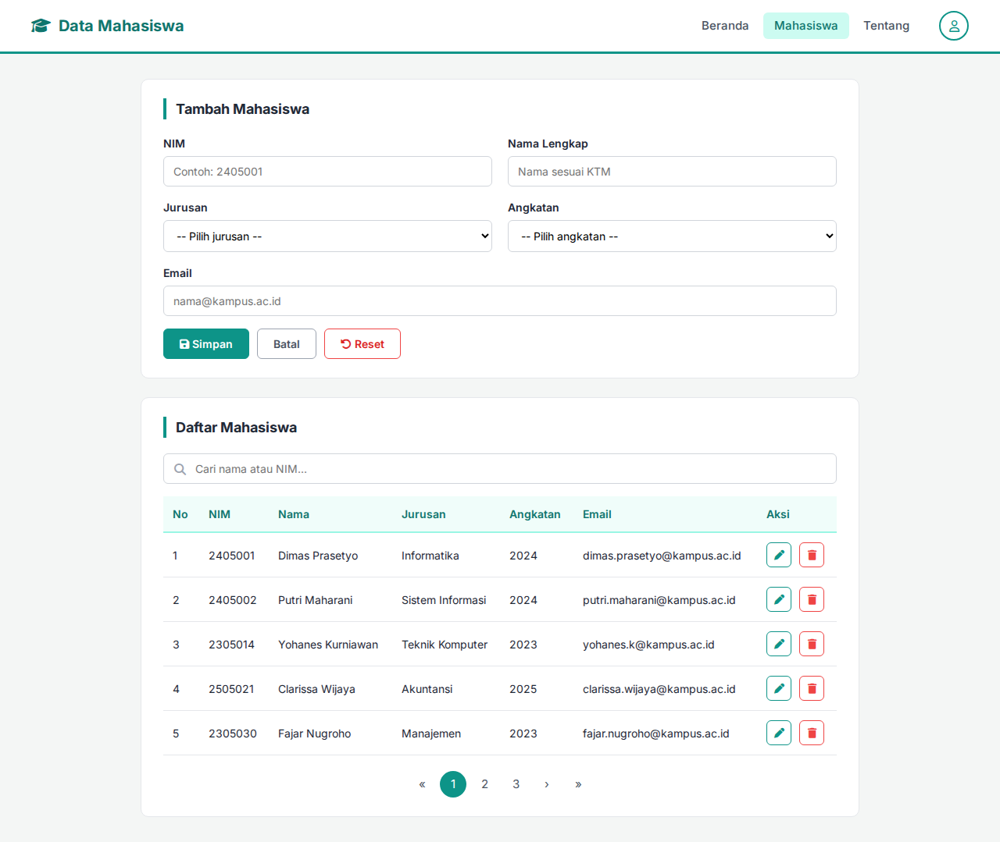
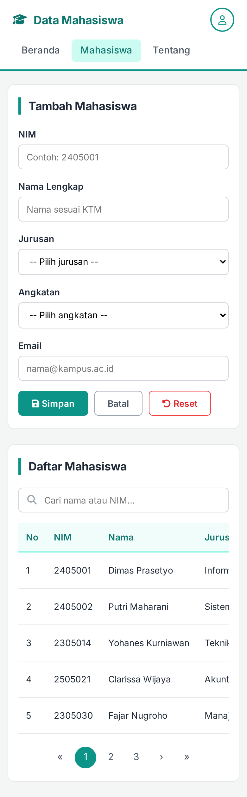

# Data Mahasiswa

Halaman pengelolaan data mahasiswa berisi form tambah mahasiswa dan tabel daftar mahasiswa, dibuat menggunakan HTML dan CSS saja.

- Website: https://jojoevan.github.io/web-programming/task-meeting-5/

## Struktur File

```
index.html    Halaman Mahasiswa: form tambah mahasiswa, pencarian, tabel daftar mahasiswa, pagination
style.css     CSS untuk halaman
screenshots/  Screenshot hasil akhir (desktop dan mobile)
```

## Screenshot

| Desktop | Mobile |
|---|---|
|  |  |

## Catatan

- Data mahasiswa pada tabel adalah data contoh.
- Form, pencarian, tombol aksi, dan pagination hanya tampilan, tanpa JavaScript.
- Ikon menggunakan Font Awesome dan font menggunakan Inter dari Google Fonts.
